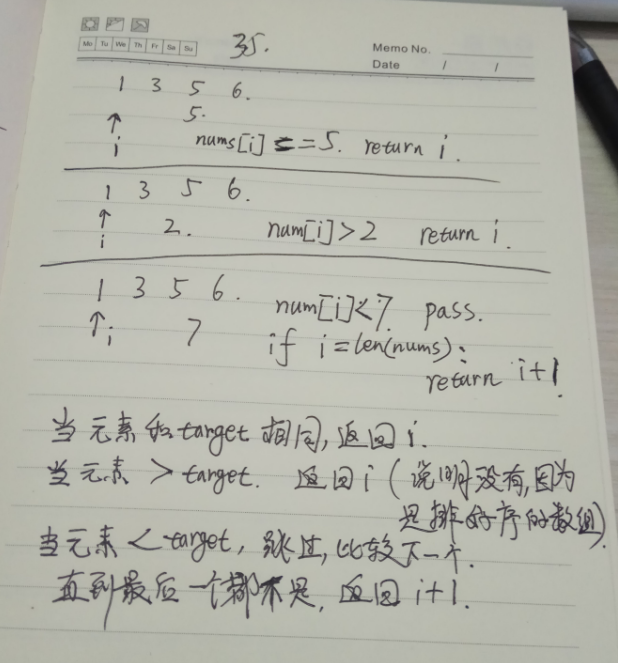

# 搜索插入位置

## 题目

给定一个排序数组和一个目标值，在数组中找到目标值，并返回其索引。如果目标值不存在于数组中，返回它将会被按顺序插入的位置。

你可以假设数组中无重复元素。

示例 1:

```
输入: [1,3,5,6], 5
输出: 2
```

示例 2:

```
输入: [1,3,5,6], 2
输出: 1
```

示例 3:

```
输入: [1,3,5,6], 7
输出: 4
```

示例 4:

```
输入: [1,3,5,6], 0
输出: 0
```

## 解题思路



## 代码

```python
class Solution(object):
    def searchInsert(self, nums, target):
        """
        :type nums: List[int]
        :type target: int
        :rtype: int
        """
        if not nums:
            return 0
        
        for i in range(len(nums)):
            if nums[i] >= target:
                return i
        return i + 1
```

