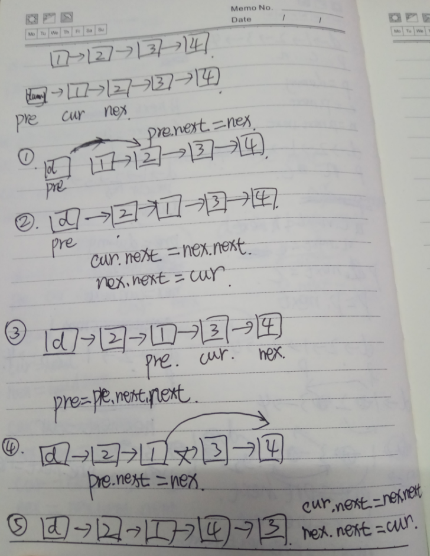

# 两两交换链表中的节点

给定一个链表，两两交换其中相邻的节点，并返回交换后的链表。

你不能只是单纯的改变节点内部的值，而是需要实际的进行节点交换。

示例:

```
给定 1->2->3->4, 你应该返回 2->1->4->3.
```

## 解题过程



```python
# Definition for singly-linked list.
# class ListNode(object):
#     def __init__(self, x):
#         self.val = x
#         self.next = None

class Solution(object):
    def swapPairs(self, head):
        """
        :type head: ListNode
        :rtype: ListNode
        """
        dummy = ListNode(0)
        dummy.next = head
        pre = dummy
        
        while pre.next and pre.next.next:
            cur = pre.next
            nex = cur.next
            
            pre.next = nex
            cur.next = nex.next
            nex.next = cur
            
            pre = pre.next.next
        return dummy.next
```

