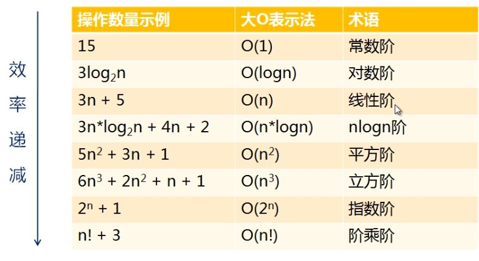

# 时间复杂度分析

**复杂度分析是整个算法学习的精髓，只要掌握了它，数据结构和算法的内容基本上就掌握了一半**

## 大 O 复杂度表示法

算法的执行效率，粗略地讲，就是算法代码执行的时间。

但是，如何在不运行代码的情况下，用“肉眼”得到一段代码的执行时间呢？这里有段非常简单的代码，求 1,2,3…n 

的累加和。现在，我就带你一块来估算一下这段代码的执行时间。 

```c
 int cal(int n) {
   int sum = 0;
   int i = 1;
   for (; i <= n; ++i) {
     sum = sum + i;
   }
   return sum;
 }
```

从 CPU 的角度来看，这段代码的每一行都执行着类似的操作：**读数据-运算-写数据**。尽管每行代码对应的 CPU 执

行的个数、执行的时间都不一样，但是，我们这里只是粗略估计，所以可以假设每行代码执行的时间都一样，为 

unit_time。在这个假设的基础之上，这段代码的总执行时间是多少呢？ 

 第 2、3 行代码分别需要 1 个 unit_time 的执行时间，第 4、5 行都运行了 n 遍，所以需要 2n unit_time 的执行

时间，所以这段代码总的执行时间就是 (2n+2)*unit_time。可以看出来，**所有代码的执行时间 T(n) 与每行代码的**

**执行次数成正比**。 


按照这个分析思路，我们再来看这段代码。

```c
int cal(int n) {
   int sum = 0;
   int i = 1;
   int j = 1;
   for (; i <= n; ++i) {
     j = 1;
     for (; j <= n; ++j) {
       sum = sum +  i * j;
     }
   }
 }
```

我们依旧假设每个语句的执行时间是 unit_time。那这段代码的总执行时间 T(n) 是多少呢？

第 2、3、4 行代码，每行都需要 1 个 unit_time 的执行时间，第 5、6 行代码循环执行了 n 遍，需要 2n * 

unit_time 的执行时间，第 7、8 行代码循环执行了 n2遍，所以需要 2n2* unit_time 的执行时间。所以，整段代

码总的执行时间 T(n) = (2n2+2n+3)*unit_time。

尽管我们不知道 unit_time 的具体值，但是通过这两段代码执行时间的推导过程，我们可以得到一个非常重要的规

律，那就是，**所有代码的执行时间 T(n) 与每行代码的执行次数 n 成正比**。


我们可以把这个规律总结成一个公式。注意，大 O 就要登场了！


我来具体解释一下这个公式。其中，T(n) 我们已经讲过了，它表示代码执行的时间；n 表示数据规模的大小；f(n) 

表示每行代码执行的次数总和。因为这是一个公式，所以用 f(n) 来表示。公式中的 O，表示代码的执行时间 T(n) 

与 f(n) 表达式成正比。

所以，第一个例子中的 T(n) = O(2n+2)，第二个例子中的 T(n) = O(2n2+2n+3)。这就是**大 O 时间复杂度表示法**。

大 O 时间复杂度实际上并不具体表示代码真正的执行时间，而是表示**代码执行时间随数据规模增长的变化趋势**，

所以，也叫作**渐进时间复杂度（asymptotic time complexity）**，简称**时间复杂度**。


当 n 很大时，你可以把它想象成 10000、100000。而公式中的低阶、常量、系数三部分并不左右增长趋势，所以

都可以忽略。我们只需要记录一个最大量级就可以了，如果用大 O 表示法表示刚讲的那两段代码的时间复杂度，

就可以记为：T(n) = O(n)； T(n) = O(n2)。

## 时间复杂度分析

前面介绍了大 O 时间复杂度的由来和表示方法。现在我们来看下，如何分析一段代码的时间复杂度？我这儿有三

个比较实用的方法可以分享给你。

1. ### 只关注循环执行次数最多的一段代码

   我刚才说了，大 O 这种复杂度表示方法只是表示一种变化趋势。我们通常会忽略掉公式中的常量、低阶、系

   数，只需要记录一个最大阶的量级就可以了。所以，我们在分析一个算法、一段代码的时间复杂度的时候，也

   只关注循环执行次数最多的那一段代码就可以了。这段核心代码执行次数的 n 的量级，就是整段要分析代码

   的时间复杂度。

   

   为了便于你理解，我还拿前面的例子来说明。

   ```c
   int cal(int n) {
      int sum = 0;
      int i = 1;
      for (; i <= n; ++i) {
        sum = sum + i;
      }
      return sum;
    }
   ```

   其中第 2、3 行代码都是常量级的执行时间，与 n 的大小无关，所以对于复杂度并没有影响。循环执行次数最

   多的是第 4、5 行代码，所以这块代码要重点分析。前面我们也讲过，这两行代码被执行了 n 次，所以总的时

   间复杂度就是 O(n)。

2. ### 加法法则：总复杂度等于量级最大的那段代码的复杂度

   我这里还有一段代码。你可以先试着分析一下，然后再往下看跟我的分析思路是否一样。

   ```c
   int cal(int n) {
      int sum_1 = 0;
      int p = 1;
      for (; p < 100; ++p) {
        sum_1 = sum_1 + p;
      }
   
      int sum_2 = 0;
      int q = 1;
      for (; q < n; ++q) {
        sum_2 = sum_2 + q;
      }
    
      int sum_3 = 0;
      int i = 1;
      int j = 1;
      for (; i <= n; ++i) {
        j = 1; 
        for (; j <= n; ++j) {
          sum_3 = sum_3 +  i * j;
        }
      }
    
      return sum_1 + sum_2 + sum_3;
    }
   ```

   这个代码分为三部分，分别是求 sum_1、sum_2、sum_3。我们可以分别分析每一部分的时间复杂度，然后

   把它们放到一块儿，再取一个量级最大的作为整段代码的复杂度。

   

   第一段的时间复杂度是多少呢？这段代码循环执行了 100 次，所以是一个常量的执行时间，跟 n 的规模无

   关。

   

   这里我要再强调一下，即便这段代码循环 10000 次、100000 次，只要是一个已知的数，跟 n 无关，照样也

   是常量级的执行时间。当 n 无限大的时候，就可以忽略。尽管对代码的执行时间会有很大影响，但是回到时

   间复杂度的概念来说，它表示的是一个算法执行效率与数据规模增长的变化趋势，所以不管常量的执行时间多

   大，我们都可以忽略掉。因为它本身对增长趋势并没有影响。

   

   那第二段代码和第三段代码的时间复杂度是多少呢？答案是 O(n) 和 O(n2)，你应该能容易就分析出来，我

   就不啰嗦了。

   ​	

   综合这三段代码的时间复杂度，我们取其中最大的量级。所以，整段代码的时间复杂度就为 O(n2)。也就是

   说：**总的时间复杂度就等于量级最大的那段代码的时间复杂度**。那我们将这个规律抽象成公式就是：

   如果 T1(n)=O(f(n))，T2(n)=O(g(n))；那么 T(n)=T1(n)+T2(n)=max(O(f(n)), O(g(n))) =O(max(f(n), g(n))).

3. ### 乘法法则：嵌套代码的复杂度等于嵌套内外代码复杂度的乘积

   我刚讲了一个复杂度分析中的加法法则，这儿还有一个**乘法法则**。类比一下，你应该能“猜到”公式是什么样子

   的吧？

   

   如果 T1(n)=O(f(n))，T2(n)=O(g(n))；

   那么 T(n)=T1(n)*T2(n)=O(f(n))*O(g(n))=O(f(n)*g(n)).

   

   也就是说，假设 T1(n) = O(n)，T2(n) = O(n2)，则 T1(n) * T2(n) = O(n3)。落实到具体的代码上，我们可以把

   乘法法则看成是**嵌套循环**，我举个例子给你解释一下。

   ```c
   int cal(int n) {
      int ret = 0; 
      int i = 1;
      for (; i < n; ++i) {
        ret = ret + f(i);
      } 
    } 
    
    int f(int n) {
     int sum = 0;
     int i = 1;
     for (; i < n; ++i) {
       sum = sum + i;
     } 
     return sum;
    }
   ```

   我们单独看 cal() 函数。假设 f() 只是一个普通的操作，那第 4～6 行的时间复杂度就是，T1(n) = O(n)。但 f() 

   函数本身不是一个简单的操作，它的时间复杂度是 T2(n) = O(n)，所以，整个 cal() 函数的时间复杂度就是，

   T(n) = T1(n) * T2(n) = O(n*n) = O(n2)。

   

   我刚刚讲了三种复杂度的分析技巧。不过，你并不用刻意去记忆。实际上，复杂度分析这个东西关键在于“熟

   练”。你只要多看案例，多分析，就能做到“无招胜有招”。

   ## 几种常见时间复杂度实例分析

   

   ### O(1)

   首先你必须明确一个概念，O(1) 只是常量级时间复杂度的一种表示方法，并不是指只执行了一行代码。比如

   这段代码，即便有 3 行，它的时间复杂度也是 O(1），而不是 O(3)。

   ```c
    int i = 8;
    int j = 6;
    int sum = i + j;
   ```

   我稍微总结一下，只要代码的执行时间不随 n 的增大而增长，这样代码的时间复杂度我们都记作 O(1)。或者

   说，**一般情况下，只要算法中不存在循环语句、递归语句，即使有成千上万行的代码，其时间复杂度也是**

   **Ο(1)。**

   ### O(logn)、O(nlogn)

   对数阶时间复杂度非常常见，同时也是最难分析的一种时间复杂度。我通过一个例子来说明一下。

   ```c
    i=1;
    while (i <= n)  {
      i = i * 2;
    }
   ```

   根据我们前面讲的复杂度分析方法，第三行代码是循环执行次数最多的。所以，我们只要能计算出这行代码被

   执行了多少次，就能知道整段代码的时间复杂度。

   

   从代码中可以看出，变量 i 的值从 1 开始取，每循环一次就乘以 2。当大于 n 时，循环结束。还记得我们高中

   学过的等比数列吗？实际上，变量 i 的取值就是一个等比数列。如果我把它一个一个列出来，就应该是这个样

   子的：

   

   

   所以，我们只要知道 x 值是多少，就知道这行代码执行的次数了。通过 2x=n 求解 x 这个问题我们想高中应该

   就学过了，我就不多说了。x=log2n，所以，这段代码的时间复杂度就是 O(log2n)。

   现在，我把代码稍微改下，你再看看，这段代码的时间复杂度是多少？

   ```c
    i=1;
    while (i <= n)  {
      i = i * 3;
    }
   ```

   根据我刚刚讲的思路，很简单就能看出来，这段代码的时间复杂度为 O(log3n)。

   

   实际上，不管是以 2 为底、以 3 为底，还是以 10 为底，我们可以把所有对数阶的时间复杂度都记为 

   O(logn)。为什么呢？

   

   我们知道，对数之间是可以互相转换的，log3n 就等于 log32 * log2n，所以 O(log3n) = O(C * log2n)，其中 

   C=log32 是一个常量。基于我们前面的一个理论：**在采用大 O 标记复杂度的时候，可以忽略系数，即O(Cf(n))** **= O(f(n))**。所以，O(log2n) 就等于 O(log3n)。因此，在对数阶时间复杂度的表示方法里，我们忽略

   对数的“底”，统一表示为 O(logn)。

   

   如果你理解了我前面讲的 O(logn)，那 O(nlogn) 就很容易理解了。还记得我们刚讲的乘法法则吗？如果一段

   代码的时间复杂度是 O(logn)，我们循环执行 n 遍，时间复杂度就是 O(nlogn) 了。而且，O(nlogn) 也是一种

   非常常见的算法时间复杂度。比如，归并排序、快速排序的时间复杂度都是 O(nlogn)。