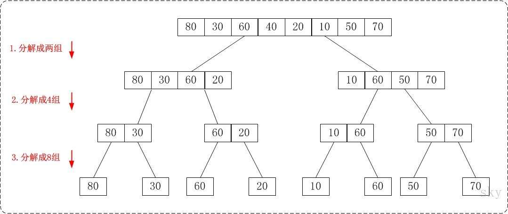
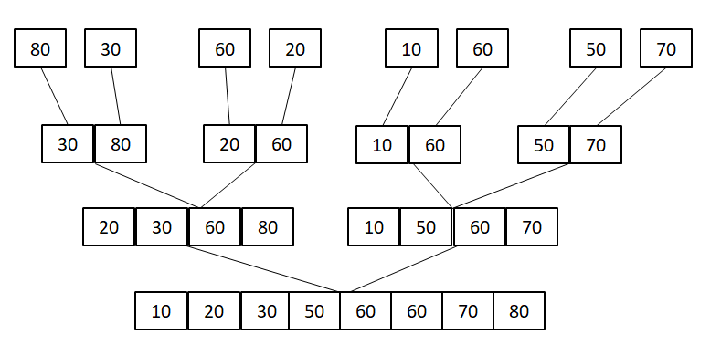
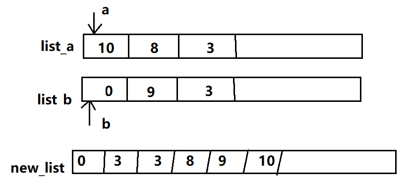

---

---

# 分治法 (Divide and Conquer)

很多有用的算法结构上是递归的，为了解决一个特定问题，算法一次或者多次递归调用其自身以解决若干子问题。 这些算法典型地遵循分治法的思想：将原问题分解为几个规模较小但是类似于原问题的子问题，递归求解这些子问题， 然后再合并这些问题的解来建立原问题的解。

分治法在每层递归时有三个步骤：

- **分解**原问题为若干子问题，这些子问题是原问题的规模最小的实例
- **解决**这些子问题，递归地求解这些子问题。当子问题的规模足够小，就可以直接求解
- **合并**这些子问题的解成原问题的解

# 归并排序

现在我们就来看下归并排序是是如何利用分治法解决问题的。

1. **分解**：将待排序的 n 个元素分成各包含 n/2 个元素的子序列
1. **解决**：使用归并排序递归排序两个子序列
1. **合并**：合并两个已经排序的子序列以产生已排序的答案


例如：列表 [80, 30, 60, 40, 20, 10, 50, 70]
使用分治法进行排序，首先递归着将数组进行分解



当数组被完全分隔成只有单个元素的数组时，我们需要把它们合并回去，每次两两合并成一个有序的序列。



用递归代码来描述这个问题：


```python
def merge_sort(seq):
    '''归并排序'''
    if len(seq) <= 1:  # 递归出口
        return seq

    # 中间位置
    mid = len(seq) // 2

    # 递归拆分成左右两个部分
    left_half = merge_sort(seq[:mid])
    right_half = merge_sort(seq[mid:])

    # 再将排好序的合并回去
    new_sort_list = merge_sort_list(left_half, right_half)
    return new_sort_list
```

有一个函数没有实现，就是`merge_sort_list`，怎么合并两个有序列表。



合并两个有序列表：将所有的数保存到一个新的列表中，分别用两个指针a，b遍历列表a，列表b，判断元素的大小，直到某一个列表遍历结束，最后把剩余的元素追加到new_list中。

```python
def merge_sort_list(sort_a, sort_b):
    '''
        合并两个有序列表
    :param sort_a: 有序列表a
    :param sort_b: 有序列表b
    '''
    a = b = 0
    length_a, length_b = len(sort_a), len(sort_b)
    new_sort_list = []

    while a < length_a and b < length_b:
        if sort_a[a] < sort_b[b]:
            new_sort_list.append(sort_a[a])
            a += 1
        else:
            new_sort_list.append(sort_b[b])
            b += 1

    # 把多余的列表元素追加到new_sort_list
    while a < length_a:
        new_sort_list.append(sort_a[a])
        a += 1

    while b < length_b:
        new_sort_list.append(sort_b[b])
        b += 1

    return new_sort_list
```

