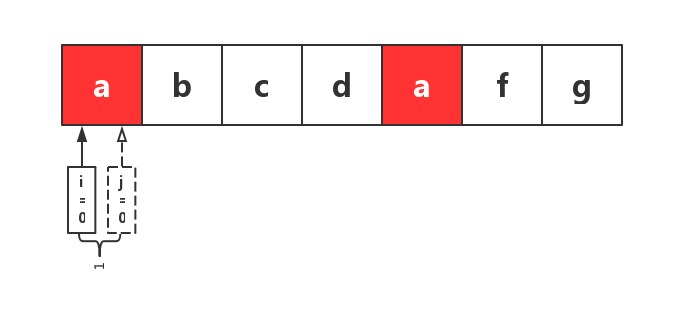
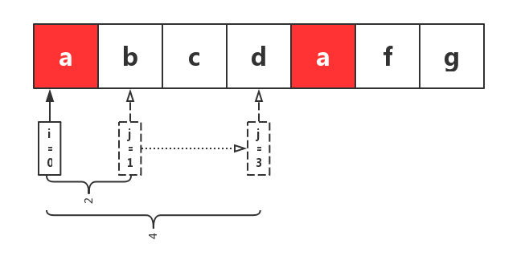
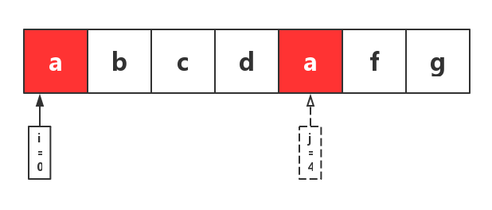
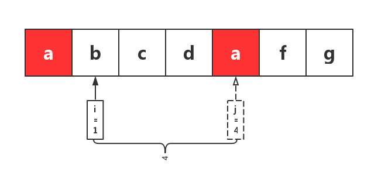
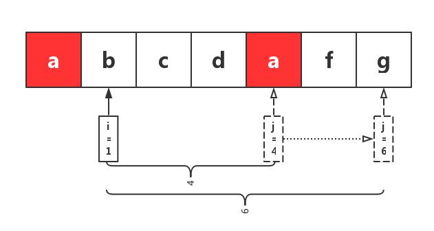

# 滑动窗口介绍

给定一个字符串，请你找出其中不含有重复字符的 最长子串 的长度。

**示例 1:**

- 输入: `"abcabcbb"`
- 输出: 3
- 解释: 因为无重复字符的最长子串是 "abc"，所以其长度为 3。

**示例 2:**

- 输入: `"bbbbb"`
- 输出: 1
- 解释: 因为无重复字符的最长子串是 "b"，所以其长度为 1。

示例 **3**:

- 输入: "pwwkew"
- 输出: 3
- 解释: 因为无重复字符的最长子串是 "wke"，所以其长度为 3。
-   请注意，你的答案必须是 子串 的长度，"pwke" 是一个子序列，不是子串。

# 思路讲解-滑动窗口

假设原始字符串S如下

从左侧开始遍历S，以i标记窗口左侧，j标记窗口右侧，初始时，i=0，j=0，即开头a所在的位置，此时，窗口大小为1

然后，将j右移，逐步扩大窗口，依次经过b、c、d，此时，窗口内均无重复字符，继续右移j

当j移动到d后面的a所在位置时，对应字符a在窗口中已存在，此时，窗口大小为5，去除当前重复的一位，窗口大小为4。此时窗口内的字符串abcd为

找到窗口中已存在的该字符所在位置，并将i移动到该位置下一位

此时为第二个窗口

继续重复之前的操作，直到j移动到字符串最后一位停止。

# 算法应用

leetcode: [无重复字符的最长字串](https://leetcode-cn.com/problems/longest-substring-without-repeating-characters/)
