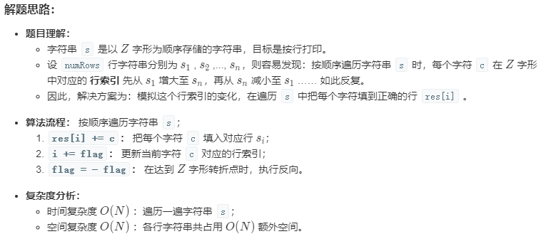
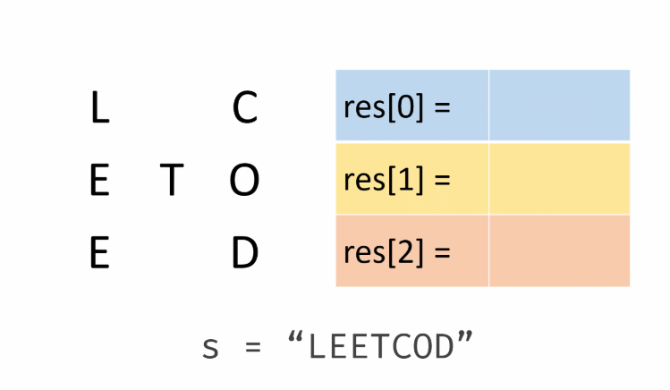

#  Z 字形变换

## 题目

将一个给定字符串根据给定的行数，以从上往下、从左到右进行 Z 字形排列。

比如输入字符串为 `"LEETCODEISHIRING"` 行数为 3 时，排列如下：

```
L   C   I   R
E T O E S I I G
E   D   H   N
```

之后，你的输出需要从左往右逐行读取，产生出一个新的字符串，比如：`"LCIRETOESIIGEDHN"`。

请你实现这个将字符串进行指定行数变换的函数：

```python
string convert(string s, int numRows);
```

**示例 1:**

```python
输入: s = "LEETCODEISHIRING", numRows = 3
输出: "LCIRETOESIIGEDHN"
```

**示例 2:**

```python
输入: s = "LEETCODEISHIRING", numRows = 4
输出: "LDREOEIIECIHNTSG"
解释:

L     D     R
E   O E   I I
E C   I H   N
T     S     G
```

## 题解

### 题意

我开始读了两遍题，读懂了题意，题目让我写一个函数，有两个参数，一个参数是原始字符串，第二个参数是变形成**Z**形字符的行数，然后函数返回Z形字符每一行的字符组成的字符串。

### 笔者的想法

我开始的想法是用二维数组，python里就列表套列表，然后实现起来感觉还是有点烦的，作为刚开始刷leetcode的我，我的想法肯定不是什么好的思路（这里不是妄自菲薄，只是认清现实）。

### 力扣上大神的见解



**大致意思就是说：**

​	遍历原始字符串，以行为单位，把遍历的字符保存在每一行上，最后把所有的行累加输出就形了。怎么控制每个字符在哪一行呢？根据题目意思，假如`numRows`为3，行号应该为 `0 1 2 1 0 1 2 1 0`一直到遍历结束，转折点就是0 和 `numRows - 1`



所以根据大神解题思路我写出了我的代码：

```python
class Solution:
    def convert(self, s: str, numRows: int): # -> str:
        if numRows == 1:
            return s

        res = ['' for _ in range(numRows)]  # ['', '', '']
        flag = None  # 标志是行增还剩行减
        i = 0  # 行号

        for ch in s:
            if i == 0:
                flag = 1
            if i == numRows - 1:
                flag = -1

            res[i] += ch
            i += flag
        return ''.join(res)
```

当numRows == 1的时候，也就是变形成一行，和源字符串一致，直接返回就行了。

**大神的代码**

```python
class Solution:
    def convert(self, s: str, numRows: int) -> str:
        if numRows < 2: return s
        res = ["" for _ in range(numRows)]
        i, flag = 0, -1
        for c in s:
            res[i] += c
            if i == 0 or i == numRows - 1: flag = -flag
            i += flag
        return "".join(res)
```

## 体会

自己和大神的差距还剩很明显的，大神的解决思路一看就豁然开朗了，自己有想法，但是不容易实现，大神代码的简洁性是真的高，加油吧！

毕竟自己才刚开始。

